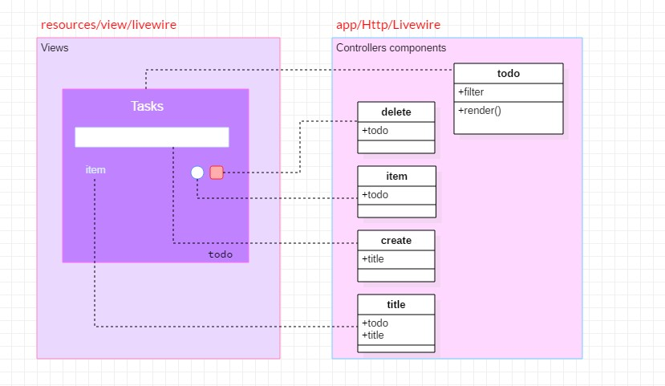

	

	
    
    
    
	

## Projeto Todo task 
Este é uma `aplicação Laravel` utilizando a "extensão" `Livewire`. Uma extensão reativa, que agiliza o desenvolvimento
com `componentes reativo` "sem" o uso de javascript (Existe o javascript, mas não precisamos se preocupar com  desenvolvimento).

> Com **livewire** temos componentes responsivos e juntamente com o blade, temos uma ferramenta poderosa. Componentes que podemos atualizar sem
>precisar atualizar toda página de forma fácil e rápida.

##### Descrição de funcionalidades do `app task`
- **listagem de todas atividades** _Criação de compoenente `todo` e busca de atividades por `query` e `when` para filtro_ e messagem de listagem vazia caso não tenha.
- **Filtro das atividades por `pendentes` e `concluídas`** _Criação de propriedade `filter` com status `all, pending, done` para query `when`_.
- **Ordenação da listagem** _Utilização de `orderBy` por `checked` de atividades_.
- **`Check` com input da atividade concluída** _Criação de input do typo `checkbox` para concluir atividade com novo componente `item` com metodo updatedTodo da propriedade Propriedade `Todo $todo`_.
- **Reoordenação da listagem ao check da atividade** _Utilização de `event` livewire no compoente `Item` que vai ao `salvar` fazer o `refresh` na listagem do component `Todo` pelo evento `emitTo e listeners`_.
- **Exclusão da atividade** _ _
- **Creação de atividade** _ _
- **No frontend:** _Layout responsivo e mode dark_.

	

######  Tecnologias (serviços externos, libs, frameworks, hospedagem etc.) e instalações.

- <a href="#" target="_blank">Php `8.2`</a>
- <a href="#" target="_blank">Laravel `9.52.5`</a> [Projeto laravel] composer create-project laravel/laravel name-project
- <a href="#" target="_blank">Livewire `2.12`</a> [Livewire] composer require livewire/livewire
- <a href="#" target="_blank">laravel debugbar `3.8`</a> [Debugbar] composer require barryvdh/laravel-debugbar --dev
- <a href="#" target="_blank">Remixicon `2.5.0`</a> [CDN]
- <a href="#" target="_blank">Tailwindcss `3.3.3`</a> [Tailwindcss] npm install -D tailwindcss postcss autoprefixer
    - Configuração do framework esta neste link [Install Tailwind CSS with Laravel](https://tailwindcss.com/docs/guides/laravel)

## Desenvolvimento (backend lógica e comandos)
- `php artisan serve --port=8000` [inicializando servidor] 
- `php artisan livewire:make todo ` [Criando componente todo] 
- `php artisan make:model Todo -m ` [Criado a tabela modelo para add propriedades] 
    - checked **boolean** _nullable false_
    - title **string**
- `php artisan make:factory TodoFactory --model=Todo ` [Criado a migration para tabela no banco] 
    - checked => **$this->faker->_boolean_**
    - title => **$this->faker->_sentence_**
- `php artisan migrate --seed ` [Criado a migration de todas tabelas no banco e seed populando dados fakes] 
- **Criação do componentes de interação**  _**A ideia é trabalhar com cada `componente livewire` de modo separado e não no proprio componente `todo`, para assim não ter um componente com muitas responsabilidades e desta forma cada componente tera a sua.**_
    - `php artisan livewire:make todo.item ` [Criando componente todo item] | _Componente que terá a responsabilidade de realizar o checked da atividade_.
    - `php artisan livewire:make todo.create ` [Criando componente todo create] | _Componente que terá a responsabilidade de criar componente com seu titulo_.
    - `php artisan livewire:make todo.delete ` [Criando componente todo delete] | _Componente que terá a responsabilidade de deletar a tividade_.

    
## Desenvolvimento (Frontend layout e lógica)

`View blade *calculator*`
~~~~~~view
<input type="text" class="values" wire:model="tot" disabled="">
<input type="text" class="values" value="{{$math}}" placeholder="0">
~~~~~~

| Diretiva | Explicação |
| :---         |     :---      |
| `wire:model` | *Recebe uma propriedade "tot" pública da classe do componente, e toda vez que um elemento de entrada com esta diretiva é atualizado, a propriedade sincroniza com seu valor* |
| `wire:click` | *Escuta um evento "click" e aciona o método "math" no componente.* |

~~~~~~

    <input type="button" name="" wire:click="addMath('^')" value="&radic;" class="global">
    <input type="button" name="" wire:click="addMath('(')" value="(" class="global">
    <input type="button" name="" wire:click="addMath(')')" value=")" class="global">
    <input type="button" name="" wire:click="addMath('%')" value="%" class="global">

    <input type="button" name="" wire:click="addMath(7)" value="7" class="global">
    <input type="button" name="" wire:click="addMath(8)" value="8" class="global">
    <input type="button" name="" wire:click="addMath(9)" value="9" class="global">
    <input type="button"         wire:click="addMath('/')" name="" value="/" class="global">

    <input type="button" name="" wire:click="addMath(4)" value="4" class="global">
    <input type="button" name="" wire:click="addMath(5)" value="5" class="global">
    <input type="button" name="" wire:click="addMath(6)" value="6" class="global">
    <input type="button" name="" wire:click="addMath('*')" value="X" class="global">

    <input type="button" name="" wire:click="addMath(1)" value="1" class="global">
    <input type="button" name="" wire:click="addMath(2)" value="2" class="global">
    <input type="button" name="" wire:click="addMath(3)" value="3" class="global">
    <input type="button" name="" wire:click="addMath('-')" value="-" class="global">

    

        <input type="button" name="" wire:click="addMath(0)" value="0" class="big global">
        <input type="button" name="" wire:click="addMath('.')" value="." class="small global">
        <input type="button" name="" wire:click="clear" value="Del" class="global red small white-text top-margin">
        <input type="button" name="" wire:click="addMath('+')" value="+" class="global grey plus">
    

    

        <input type="button" name="" wire:click="result" value="=" class="global green white-text big top-margin result" >
    

~~~~~~

`Controller *Calculator*`
~~~~~~Calculator
    public $math = '';
    public $tot = 0;

    public function render()
    {
        return view('livewire.calculator', [
            "title" => "Calculadora"
        ]);
    }

    public function addMath($num)
    {
        $this->math .= $num;
    }

    public function result()
    {
        $this->tot = eval('return ' . $this->math . ';');
    }

    public function clear()
    {
        $this->math = '';
        $this->tot = 0;
    }
~~~~~~

| Classe | Explicação |
| :---         |     :---      |
| `public $math` | *As propriedades nos componentes sempre precisamos declarar como públicas* |
| `function render` | *Metodo **render** é como se fosse um metodo construtor de uma classe Php e renderiza a view blade e podemos passar variáveis. * |

##### Exemplos 1
Componente de descrição em um input com reatividade. A variável `pública` no controller do componente.
~~~~~~exemplo
{{$description}}
<input type="text" class="values" wire:model="description">
~~~~~~

	

##### Exemplos 2
Componente de botão com reatividade de somar e diminuir. wire:click acessa o metodo no controller do componente.
~~~~~~button
{{$number}}  
<button type="button" class="values" wire:click="addPlus">Somar</button>
<button type="button" class="values" wire:click="addMinus">Subtrair</button>
~~~~~~

~~~~~~metodos
    public function addPlus()
    {
        $this->number++;
    }
    
    public function addMinus()
    {
        $this->number--;
    }
~~~~~~

	

## Contatos

- 👇🏼 [rafaelblum_digital@hotmail.com]

 
    <em><b>Adoro me conectar com pessoas diferentes,</b> então se você quiser dizer <b>oi, ficarei feliz em conhecê-lo mais!</b> :)</em>

